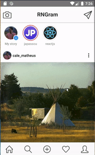

# RNGram

An Instagram clone built with React Native for learning purposes, because why not?!

For now, the app is using fake data to render the components, but later i'll try to plug a server to it and grab the posts and stories from there.

## Milestones

- [x] Main navigation
- [ ] Stack navigation for each screen
- [x] Home screen
- [ ] Search screen
- [ ] New photo screen
- [ ] Interactions screen
- [ ] Profle screen
- [ ] View Story
- [ ] Add Story screen
